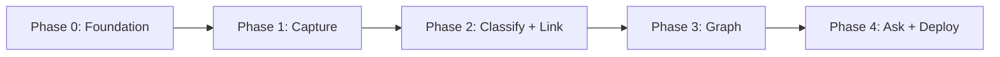

# SecondSelf — Phase-Wise Implementation Plan

This document translates [architecture.md](architecture.md) and [Problem_Statement.md](Problem_Statement.md) into an actionable build plan. Each phase is self-contained: build it, test it on **real personal data** (not dummy fixtures), and use that output as input for the next phase.

---

## Overview

| Phase | Codename | Duration | Primary Output |
|-------|----------|----------|----------------|
| 0 | Foundation | ~1 day | Repo scaffold, config, dependencies |
| 1 | The Archivist | Week 1 | `capture.py` + 10+ items in `raw/` |
| 2 | The Librarian | Week 2 | `classify.py` + `link.py` + organized `wiki/` |
| 3 | The Cartographer | Week 3 | `build_graph.py` + interactive graph |
| 4 | The Oracle | Week 4 | `ask.py` + `app.py` + public deployment |

**End-to-end flow when complete:**

```
capture → classify → link → build_graph → ask (via Streamlit app)
```

---

## Phase 0 — Foundation (Pre-Week 1)

**Goal:** Set up the project skeleton so every later phase has stable paths, config, and dependencies.

### Tasks

| # | Task | File(s) | Details |
|---|------|---------|---------|
| 0.1 | Initialize repo structure | dirs | Create `raw/`, `wiki/`, `data/`, `embeddings/` |
| 0.2 | Add shared config | `config.py` | Centralize paths, thresholds, model names |
| 0.3 | Pin dependencies | `requirements.txt` | Phase-appropriate packages (add more each phase) |
| 0.4 | Document secrets | `.env.example` | `GROQ_API_KEY=` placeholder |
| 0.5 | Git ignore | `.gitignore` | Ignore `.env`, `__pycache__/`, `.venv/`, optional `embeddings/*.npy` |
| 0.6 | Placeholder README | `README.md` | Project name, setup, phase status (expand in Phase 4) |

### `config.py` — initial values

```python
RAW_DIR = Path("raw")
WIKI_DIR = Path("wiki")
DATA_DIR = Path("data")
EMBEDDINGS_DIR = Path("embeddings")
GRAPH_PATH = DATA_DIR / "graph.json"

SIMILARITY_THRESHOLD = 0.75
MAX_LINKS_PER_NOTE = 5
RAG_TOP_K = 5
EMBEDDING_MODEL = "all-MiniLM-L6-v2"
LLM_MODEL = "llama3-8b-8192"
```

### `requirements.txt` — Phase 0 minimum

```
python-dotenv>=1.0
```

Add packages incrementally per phase (see each phase's "Dependencies" section).

### Verification

- [ ] All directories exist
- [ ] `python -c "import config"` runs without error
- [ ] Virtual environment created and activated

### Estimated effort: 2–4 hours

---

## Phase 1 — The Archivist: Capture Everything, Lose Nothing

**Badge:** The Archivist  
**Problem:** No single place to put scattered notes, links, and files.  
**Deliverable:** One-command capture pipeline; `raw/` populated with 10+ real items.

### Dependencies to add

```
# requirements.txt (Phase 1)
requests>=2.31
```

### Implementation tasks

#### 1.1 — Core capture module (`capture.py`)

| Step | Function / feature | Implementation notes |
|------|-------------------|----------------------|
| 1.1.1 | `generate_id()` | 8-char hex from `uuid.uuid4()` |
| 1.1.2 | `make_filename(timestamp, id, ext)` | Format: `{YYYYMMDD}_{HHMMSS}_{id}.{ext}` |
| 1.1.3 | `save_capture(content, capture_type, source)` | Write to `raw/`, return `CaptureRecord` dataclass |
| 1.1.4 | `capture_note(text)` | Save as `.txt` or `.md` |
| 1.1.5 | `capture_link(url)` | Save URL + optional fetched title via `requests` |
| 1.1.6 | `capture_file(path)` | Copy binary/text file into `raw/` preserving extension |
| 1.1.7 | CLI with `argparse` | Positional text, `--link`, `--file`, `--stdin` flags |
| 1.1.8 | Sidecar metadata (optional) | JSON file `{id}.meta.json` with type, timestamp, source |

#### 1.2 — CLI commands to support

```bash
python capture.py "My idea about building a RAG system"
python capture.py --link https://example.com/article
python capture.py --file ./documents/resume.pdf
echo "Quick thought from terminal" | python capture.py --stdin
```

#### 1.3 — Real-data capture session

Capture **10+ items** from your own scattered information:

- 3+ plain-text notes (ideas, todos, journal snippets)
- 3+ bookmarks/URLs you actually saved but never re-read
- 2+ files (PDF, image, or doc you reference occasionally)
- 2+ mixed captures via stdin or quick CLI notes

**Rule:** No lorem ipsum, no `test1.txt` — use real content you care about.

### Testing checklist

| Test | Expected result |
|------|-----------------|
| Capture a text note | File appears in `raw/` with timestamp + unique ID in filename |
| Capture a URL | Link saved; content includes the URL |
| Capture a file | File copied to `raw/` with correct extension |
| Capture via stdin | Works with piped input |
| Run 10+ captures | Each file has distinct ID; no overwrites |
| Re-run same command | New file created (append-only, never overwrite) |

### Acceptance criteria (from Problem Statement)

- [ ] `raw/` and `wiki/` folder structure exists
- [ ] One command captures a note, a link, AND a file
- [ ] Every capture has a timestamp + unique ID
- [ ] 10+ real items captured in `raw/`

### Phase 1 exit criteria

- `capture.py` runs from CLI without errors
- `raw/` contains ≥10 real captures
- Each capture filename follows `{YYYYMMDD}_{HHMMSS}_{id}.{ext}`
- Ready to feed `raw/` into Phase 2 classification

### Estimated effort: 1–2 days

---

## Phase 2 — The Librarian: Teach AI to Organize For You

**Badge:** The Librarian  
**Problem:** Raw captures are an unstructured pile; manual tagging never happens.  
**Deliverable:** Self-organizing wiki with PARA classification and embedding-based auto-links on 15+ real items.

### Prerequisites

- Phase 1 complete (`raw/` has captures)
- Groq API key obtained → set `GROQ_API_KEY` in `.env`

### Dependencies to add

```
groq>=0.4
sentence-transformers>=2.2
numpy>=1.24
pyyaml>=6.0
python-frontmatter>=1.0
scikit-learn>=1.3
python-dotenv>=1.0
```

---

### Phase 2.1 — Auto-Classify (`classify.py`)

#### Tasks

| Step | Function | Details |
|------|----------|---------|
| 2.1.1 | `call_llm(content) -> dict` | Groq client; system + user prompt; parse JSON response |
| 2.1.2 | `classify_capture(raw_path) -> ClassificationResult` | Returns para, tags, summary, slug |
| 2.1.3 | `write_wiki_note(raw_path, classification, body)` | Write to `wiki/{PARA}/{slug}.md` with YAML frontmatter |
| 2.1.4 | `get_unprocessed_raw()` | Skip raw files already referenced by `raw_ref` in wiki |
| 2.1.5 | `process_all_unclassified()` | Batch classify all new raw captures |
| 2.1.6 | Error handling | Invalid JSON → retry once; fallback to `Resources` + empty tags |

#### LLM prompt contract

**System:**
> You are a knowledge librarian. Classify content using PARA: Projects (active outcomes), Areas (ongoing responsibilities), Resources (reference/interest), Archives (inactive/completed). Return valid JSON only.

**User:** Raw content + instruction to return:
```json
{
  "para": "Projects",
  "tags": ["python", "rag"],
  "summary": "One-line summary under 120 chars",
  "slug": "kebab-case-title"
}
```

#### Wiki note output format

```
wiki/Projects/my-side-project.md
wiki/Areas/health-fitness.md
wiki/Resources/interesting-article.md
wiki/Archives/old-job-notes.md
```

Frontmatter (see architecture.md §4.2):
```yaml
---
id: a1b2c3d4
raw_ref: raw/20260727_143022_a1b2c3d4.txt
para: Projects
tags: [python, side-project]
summary: "Building a personal RAG system"
created: 2026-07-27T14:30:22
links: []
embedding_model: all-MiniLM-L6-v2
---
```

#### CLI

```bash
python classify.py                    # process all unclassified raw
python classify.py --file raw/xxx.txt # single file
python classify.py --force              # reprocess (overwrite wiki)
```

#### Testing (2.1)

- [ ] Single raw note → correct PARA folder + frontmatter
- [ ] Tags and summary populated by LLM
- [ ] Re-run skips already-processed files (unless `--force`)
- [ ] All Phase 1 raw captures classified into `wiki/`

---

### Phase 2.2 — Auto-Link (`link.py`)

#### Tasks

| Step | Function | Details |
|------|----------|---------|
| 2.2.1 | `load_embedding_model()` | Cache `SentenceTransformer(EMBEDDING_MODEL)` |
| 2.2.2 | `embed_note(text) -> np.ndarray` | Encode note body (strip frontmatter) |
| 2.2.3 | `save/load embedding cache` | Optional: `embeddings/{note_id}.npy` |
| 2.2.4 | `build_wiki_index()` | Dict of id → {path, vector, slug, para} |
| 2.2.5 | `find_similar_notes(vector, index, threshold)` | Cosine similarity via sklearn |
| 2.2.6 | `insert_links(note_path, matches)` | Append `[[slug]]` wikilinks; update `links:` in frontmatter |
| 2.2.7 | `link_all_notes()` | Process all wiki notes; cap at `MAX_LINKS_PER_NOTE` |

#### Linking rules

- Similarity threshold: `0.75` (tune in `config.py`)
- Max links per note: `5`
- Do not link a note to itself
- Incremental: new notes compared against full index

#### CLI

```bash
python link.py              # link all notes
python link.py --note wiki/Projects/foo.md  # single note
```

#### Testing (2.2)

- [ ] Embeddings computed for every wiki note
- [ ] Related notes (same topic) receive links above threshold
- [ ] Unrelated notes do not get spurious links
- [ ] Frontmatter `links:` array updated
- [ ] `[[wikilinks]]` appear in markdown body

---

### Phase 2.3 — Pipeline orchestrator (optional but recommended)

**File:** `pipeline.py`

```bash
python pipeline.py          # classify new raw + link new wiki notes
python pipeline.py --all    # full reprocess
```

Runs `classify.py` then `link.py` in sequence. Use this as the standard "organize my brain" command going forward.

### Expand real-data corpus

Add **5+ more captures** (total ≥15 across `raw/`) so linking has enough density to produce meaningful edges:

```bash
python capture.py "..."
python pipeline.py
```

### Acceptance criteria (from Problem Statement)

- [ ] Any raw capture → category + tags + summary automatically
- [ ] PARA categorization working (4 folders under `wiki/`)
- [ ] Embeddings computed per note
- [ ] Related notes auto-linked (no manual tagging)
- [ ] Runs on 15+ real items → organized `wiki/`

### Phase 2 exit criteria

- `wiki/` contains ≥15 classified notes across PARA categories
- At least some notes have cross-links (verify in frontmatter and body)
- `pipeline.py` (or manual classify + link) runs end-to-end without errors
- Ready for graph export in Phase 3

### Estimated effort: 3–5 days

---

## Phase 3 — The Cartographer: Visualize the Brain

**Badge:** The Cartographer  
**Problem:** Organized linked knowledge is invisible until you can explore it spatially.  
**Deliverable:** `data/graph.json` + interactive force-directed graph from real wiki data.

### Prerequisites

- Phase 2 complete (`wiki/` with linked notes)

### Dependencies to add

```
# No new Python deps required for graph builder
# vis-network loaded via CDN in HTML component (Phase 3.2 / 4)
```

---

### Phase 3.1 — Graph builder (`build_graph.py`)

#### Tasks

| Step | Function | Details |
|------|----------|---------|
| 3.1.1 | `parse_wiki_note(path) -> WikiNode` | Read frontmatter + body via `python-frontmatter` |
| 3.1.2 | `extract_wikilinks(body) -> List[str]` | Regex for `[[slug]]` patterns |
| 3.1.3 | `build_nodes(wiki_dir)` | One node per note: id, label, para, tags, summary, preview, path |
| 3.1.4 | `build_edges(notes)` | From frontmatter `links:` + parsed wikilinks |
| 3.1.5 | `export_json(graph, GRAPH_PATH)` | Write `data/graph.json` with meta block |

#### Node schema

```json
{
  "id": "a1b2c3d4",
  "label": "My Side Project",
  "para": "Projects",
  "tags": ["python"],
  "summary": "One-line summary",
  "content_preview": "First 200 characters...",
  "path": "wiki/Projects/my-side-project.md"
}
```

#### Edge schema

```json
{
  "source": "a1b2c3d4",
  "target": "e5f6g7h8",
  "weight": 0.82,
  "type": "semantic_similarity"
}
```

#### CLI

```bash
python build_graph.py
python build_graph.py --output data/graph.json
```

#### Testing (3.1)

- [ ] Every wiki note appears as exactly one node
- [ ] Linked notes produce edges (count > 0 if links exist)
- [ ] JSON is valid and human-readable
- [ ] `meta.node_count` and `meta.edge_count` match actual counts
- [ ] Built from real wiki notes, not dummy data

---

### Phase 3.2 — Interactive graph visualization

**Approach:** Standalone HTML prototype first, then embed in Streamlit in Phase 4.

#### Tasks

| Step | Task | Details |
|------|------|---------|
| 3.2.1 | Create `graph_component.html` or inline template | Load vis-network from CDN |
| 3.2.2 | Load `graph.json` | Fetch or inject JSON into HTML |
| 3.2.3 | Force-directed layout | vis-network physics enabled |
| 3.2.4 | Node styling | Color by PARA: Projects=blue, Areas=green, Resources=orange, Archives=gray |
| 3.2.5 | Hover tooltips | Show summary + content preview |
| 3.2.6 | Drag + zoom | Built-in vis-network interaction |
| 3.2.7 | Optional pulse animation | CSS class on nodes for "alive" feel |
| 3.2.8 | Standalone test page | Open HTML locally with real `graph.json` before Streamlit integration |

#### PARA color map (suggested)

| PARA | Color |
|------|-------|
| Projects | `#4A90D9` |
| Areas | `#50C878` |
| Resources | `#F5A623` |
| Archives | `#9B9B9B` |

#### Testing (3.2)

- [ ] Graph renders all nodes from real data
- [ ] Edges visible between linked notes
- [ ] Hover reveals note summary/content
- [ ] Drag repositioning works
- [ ] Scroll/pinch zoom works
- [ ] Performance acceptable with 15–50 nodes

### Acceptance criteria (from Problem Statement)

- [ ] Script builds nodes + edges from notes and exports clean JSON
- [ ] Interactive force-directed graph renders from that JSON
- [ ] Hover reveals note content
- [ ] Drag + zoom work
- [ ] Built from your real notes, not dummy data

### Phase 3 exit criteria

- `python build_graph.py` produces valid `data/graph.json`
- Graph visualization works in standalone HTML (or early Streamlit prototype)
- Graph reflects actual PARA structure and semantic links from Phase 2
- Ready for RAG + unified UI in Phase 4

### Estimated effort: 2–4 days

---

## Phase 4 — The Oracle: Ask It Anything, Ship It Public

**Badge:** The Oracle  
**Problem:** Visualization alone doesn't answer questions; the product must synthesize answers from your knowledge and be publicly accessible.  
**Deliverable:** Full Streamlit app with graph + ask bar, deployed to a public URL.

### Prerequisites

- Phases 1–3 complete
- `data/graph.json` exists
- `wiki/` populated with linked notes
- Groq API key configured

### Dependencies to add

```
streamlit>=1.28
```

---

### Phase 4.1 — RAG query engine (`ask.py`)

#### Tasks

| Step | Function | Details |
|------|----------|---------|
| 4.1.1 | Reuse embedding index from `link.py` | Shared model + wiki index builder |
| 4.1.2 | `retrieve(question, top_k) -> List[RetrievedNote]` | Embed question; cosine search over wiki |
| 4.1.3 | `build_rag_prompt(question, retrieved)` | System prompt + note chunks + question |
| 4.1.4 | `synthesize_answer(prompt) -> str` | Groq LLM call |
| 4.1.5 | `ask(question, top_k=5) -> AskResult` | Returns answer + source citations |
| 4.1.6 | Empty wiki guard | Friendly message if no notes indexed |

#### RAG prompt template

```
You answer questions using ONLY the user's personal notes below.
If the notes don't contain enough information, say so clearly.
Cite note titles when relevant. Do not invent facts.

--- NOTES ---
{note_title}: {note_content}
...
--- END ---

Question: {question}
```

#### CLI (for testing before UI)

```bash
python ask.py "What projects am I working on?"
python ask.py "What articles did I save about machine learning?"
```

#### Testing (4.1)

- [ ] Question retrieves relevant notes (inspect scores)
- [ ] Answer synthesizes from retrieved content, not hallucinated facts
- [ ] Source notes cited in response
- [ ] Works on 5+ real questions about your own captures
- [ ] Graceful handling when no relevant notes found

---

### Phase 4.2 — Streamlit app (`app.py`)

#### Tasks

| Step | Feature | Details |
|------|---------|---------|
| 4.2.1 | App layout | Header, ask bar, answer panel, graph area, sidebar |
| 4.2.2 | Load graph | `@st.cache_data` on `graph.json` |
| 4.2.3 | Embed vis-network | `st.components.v1.html()` with graph JSON injected |
| 4.2.4 | Ask bar | Text input + button → calls `ask()` |
| 4.2.5 | Answer display | Markdown answer + expandable source list |
| 4.2.6 | Stats sidebar | Node count, edge count, note count by PARA |
| 4.2.7 | Cache embeddings | `@st.cache_resource` for model + wiki index |
| 4.2.8 | Optional refresh | Button to run `build_graph.py` (or instructions to run locally) |

#### App layout

```
┌────────────────────────────────────────────────────────────┐
│  SecondSelf — Your Personal AI Second Brain               │
├────────────────────────────────────────────────────────────┤
│  [ Ask anything about your knowledge...        ] [ Ask ]    │
│  Answer + source citations                                  │
├──────────────────────────┬─────────────────────────────────┤
│   Interactive Graph      │  Sidebar: stats, note detail    │
│   (vis-network)          │                                 │
└──────────────────────────┴─────────────────────────────────┘
```

#### Local run

```bash
streamlit run app.py
```

#### Testing (4.2)

- [ ] App starts without errors
- [ ] Graph renders from `data/graph.json`
- [ ] Ask bar returns answers from your notes
- [ ] Graph hover/drag/zoom work inside Streamlit
- [ ] API key loaded from `.env` locally, secrets in cloud

---

### Phase 4.3 — Deployment

#### Platform options

| Platform | Entry point | Secrets |
|----------|-------------|---------|
| **Streamlit Cloud** (recommended) | `app.py` | `GROQ_API_KEY` in app settings |
| **Hugging Face Spaces** | `app.py` + `requirements.txt` | Space secrets |

#### Deployment checklist

| # | Step |
|---|------|
| 1 | Commit all code + `wiki/` + `data/graph.json` (or document rebuild steps) |
| 2 | Push to public GitHub repo |
| 3 | Connect repo to Streamlit Cloud |
| 4 | Set main file: `app.py` |
| 5 | Add `GROQ_API_KEY` to deployment secrets |
| 6 | Deploy and verify public URL loads |
| 7 | Test ask + graph on live URL |
| 8 | Full E2E: capture locally → pipeline → rebuild graph → push → verify deploy |

#### `.streamlit/config.toml` (optional)

```toml
[theme]
primaryColor = "#4A90D9"
backgroundColor = "#0E1117"
secondaryBackgroundColor = "#262730"
textColor = "#FAFAFA"
```

#### Security notes for public deploy

- Read-only demo on public URL (no open capture/upload without auth)
- Never commit `.env` or API keys
- Use Streamlit secrets for `GROQ_API_KEY`

---

### Phase 4.4 — Documentation & final deliverables

#### README.md sections

1. Project overview + live demo URL
2. Architecture diagram (link to `architecture.md`)
3. Setup: clone, venv, `pip install -r requirements.txt`, `.env`
4. Usage: capture, pipeline, build graph, run app
5. Deployment instructions
6. Badge/milestone checklist

### Acceptance criteria (from Problem Statement)

- [ ] `ask()` returns answers synthesized from your own notes (retrieval + LLM)
- [ ] One Streamlit app contains both the graph and the search bar
- [ ] Deployed live with a public URL
- [ ] Full pipeline works end to end in the deployed app

### Final project deliverables

- [ ] Public GitHub repo with clean README + setup instructions
- [ ] Live deployed URL — interactive graph + ask-your-brain search
- [ ] End-to-end flow verified: capture → classify → link → graph → ask
- [ ] All 4 weekly milestones complete

### Phase 4 exit criteria

- Public URL accessible and functional
- Real questions return grounded answers from your wiki
- Graph interactive on deployed app
- README documents full workflow

### Estimated effort: 4–6 days

---

## Master Build Order (Cursor Workflow)

Execute in this exact order:

```
Phase 0:  Scaffold → config.py → requirements.txt → .gitignore
Phase 1:  capture.py → test 10+ real captures
Phase 2:  classify.py → link.py → pipeline.py → 15+ items in wiki/
Phase 3:  build_graph.py → graph HTML component → verify locally
Phase 4:  ask.py → app.py → deploy → README
```

### Suggested Cursor prompts per step

| Step | Prompt |
|------|--------|
| 0 | "Scaffold SecondSelf repo per architecture.md Phase 0" |
| 1 | "Implement capture.py per Implementation-plan.md Phase 1" |
| 2a | "Implement classify.py with Groq PARA classification" |
| 2b | "Implement link.py with sentence-transformers auto-linking" |
| 3a | "Implement build_graph.py to export graph.json" |
| 3b | "Create vis-network HTML component for the graph" |
| 4a | "Implement ask.py RAG over wiki notes" |
| 4b | "Build Streamlit app.py combining graph and ask bar" |
| 4c | "Prepare for Streamlit Cloud deployment" |

---

## Phase Dependencies



| Phase | Depends on | Produces |
|-------|------------|----------|
| 0 | — | dirs, config, requirements |
| 1 | 0 | `raw/` with captures |
| 2 | 1 | `wiki/` with PARA + links |
| 3 | 2 | `data/graph.json`, graph UI |
| 4 | 2, 3 | `ask.py`, `app.py`, live URL |

---

## Testing Strategy (All Phases)

### Principle: real data only

Every phase must be validated against your own notes, links, and files — not synthetic test fixtures. This ensures linking, graph layout, and RAG answers reflect real-world behavior.

### Phase integration tests

| After phase | Integration test |
|-------------|------------------|
| 1 | Capture 3 different input types in one session; verify filenames |
| 2 | Run `pipeline.py`; inspect `wiki/` folders and cross-links manually |
| 3 | Open graph; confirm clusters match topical groups in your notes |
| 4 | Ask 5 questions you genuinely don't remember the answer to; verify against source notes |

### End-to-end smoke test (Phase 4)

```bash
# 1. Capture
python capture.py "New insight about productivity systems"

# 2. Organize
python pipeline.py

# 3. Rebuild graph
python build_graph.py

# 4. Ask
python ask.py "What do I know about productivity systems?"

# 5. UI
streamlit run app.py
```

---

## Risk Register & Mitigations

| Risk | Phase | Mitigation |
|------|-------|------------|
| Groq API rate limits | 2, 4 | Batch classify; cache results; retry with backoff |
| LLM returns invalid JSON | 2 | Retry prompt; regex extract JSON; fallback category |
| No links generated (sparse data) | 2 | Capture more related notes; lower threshold temporarily |
| Embedding model download slow | 2 | Pre-download; document first-run wait in README |
| Graph too dense ("hairball") | 3 | Lower `MAX_LINKS_PER_NOTE`; filter weak edges in UI |
| RAG hallucination | 4 | Strict prompt: "answer only from notes"; show sources |
| Streamlit graph not interactive | 4 | Test HTML component standalone first |
| API key exposed | 4 | `.gitignore` `.env`; use platform secrets only |

---

## Timeline Summary

| Phase | Effort | Cumulative |
|-------|--------|------------|
| 0 — Foundation | 0.5 day | 0.5 day |
| 1 — Archivist | 1–2 days | 2.5 days |
| 2 — Librarian | 3–5 days | 7.5 days |
| 3 — Cartographer | 2–4 days | 11.5 days |
| 4 — Oracle | 4–6 days | 17.5 days |

**Total estimated build time:** ~3–4 weeks (aligned with the problem statement cadence).

---

## Quick Reference — Commands After Full Build

```bash
# Capture anything
python capture.py "note text"
python capture.py --link https://...
python capture.py --file ./doc.pdf

# Organize + link
python pipeline.py

# Build graph
python build_graph.py

# Ask a question (CLI)
python ask.py "your question here"

# Run local app
streamlit run app.py
```

---

## Related Documents

- [Problem_Statement.md](Problem_Statement.md) — goals, weekly problems, acceptance criteria
- [architecture.md](architecture.md) — system design, data models, component specs
