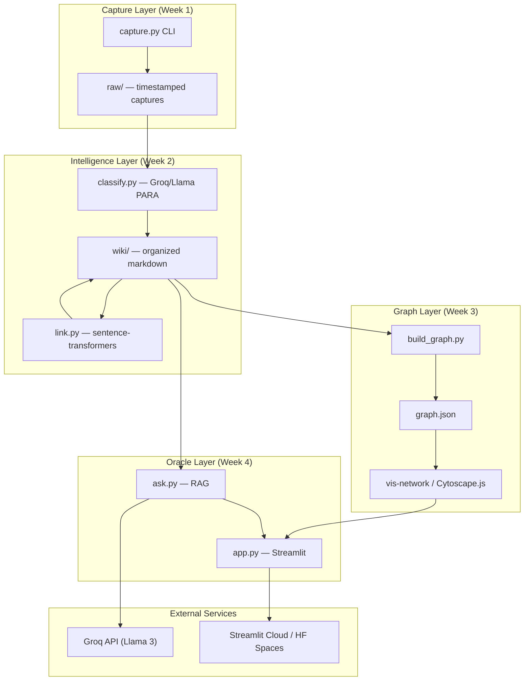
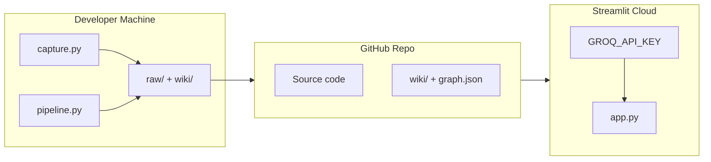

# SecondSelf — Detailed System Architecture

Architecture for an end-to-end personal knowledge system: capture → classify → link → visualize → query → deploy.

---

## 1. Vision & Design Principles

| Principle | Implication |
|-----------|-------------|
| **Capture-first** | Zero friction at input; structure comes later |
| **AI organizes, human explores** | PARA + embeddings replace manual filing |
| **Local-first, cloud-optional** | Raw files on disk; embeddings computed locally |
| **Progressive enhancement** | Each week adds a layer without breaking prior work |
| **Single deployable product** | Week 4 unifies everything in one Streamlit app |

The system is **not** a notes app or chatbot — it is a **pipeline + knowledge graph + RAG oracle** over your own data.

---

## 2. High-Level Architecture



---

## 3. Repository Structure

```
secondself/
├── raw/                          # Immutable capture inbox
│   └── {timestamp}_{uuid}.{ext}  # e.g. 20260727_143022_a1b2c3d4.txt
├── wiki/                         # Processed, linked knowledge
│   └── {para}/{slug}.md          # e.g. projects/my-side-project.md
├── embeddings/                   # Optional: cached vectors per note
│   └── {note_id}.npy
├── data/
│   └── graph.json                # Exported graph (nodes + edges)
├── capture.py                    # Week 1
├── classify.py                   # Week 2.1
├── link.py                       # Week 2.2
├── build_graph.py                # Week 3.1
├── ask.py                        # Week 4.1
├── app.py                        # Week 4.2 — Streamlit UI
├── pipeline.py                   # Optional: orchestrate classify → link
├── config.py                     # Thresholds, paths, API keys
├── requirements.txt
├── .env.example                  # GROQ_API_KEY, etc.
├── .streamlit/config.toml        # Theme, layout
└── README.md
```

---

## 4. Data Models

### 4.1 Raw Capture (Week 1)

Every capture is a file in `raw/` with metadata in the filename and optional frontmatter.

**Filename convention:**
```
{YYYYMMDD}_{HHMMSS}_{short_uuid}.{ext}
```

**Supported input types:**

| Type | Extension | Content |
|------|-----------|---------|
| Note (text) | `.txt` / `.md` | Plain text or stdin |
| Link | `.url` or `.md` | URL + optional fetched title/snippet |
| File | original ext | Binary copy (PDF, image, etc.) |

**Minimal metadata file (optional sidecar):**
```json
{
  "id": "a1b2c3d4",
  "timestamp": "2026-07-27T14:30:22+05:30",
  "type": "note|link|file",
  "source": "cli|stdin|path",
  "original_path": "/path/to/source.pdf"
}
```

### 4.2 Wiki Note (Week 2)

Processed notes live in `wiki/` under PARA folders.

**Path:** `wiki/{Projects|Areas|Resources|Archives}/{slug}.md`

**Frontmatter schema:**
```yaml
---
id: a1b2c3d4
raw_ref: raw/20260727_143022_a1b2c3d4.txt
para: Projects          # PARA category
tags: [python, side-project]
summary: "One-line summary from LLM"
created: 2026-07-27T14:30:22
links: [other-note-id-1, other-note-id-2]
embedding_model: all-MiniLM-L6-v2
---
```

**Body:** Markdown content (original text + auto-inserted `[[wikilinks]]` to related notes).

### 4.3 Graph Model (Week 3)

**`graph.json` schema:**
```json
{
  "nodes": [
    {
      "id": "a1b2c3d4",
      "label": "My Side Project",
      "para": "Projects",
      "tags": ["python"],
      "summary": "One-line summary",
      "content_preview": "First 200 chars...",
      "path": "wiki/Projects/my-side-project.md"
    }
  ],
  "edges": [
    {
      "source": "a1b2c3d4",
      "target": "e5f6g7h8",
      "weight": 0.82,
      "type": "semantic_similarity"
    }
  ],
  "meta": {
    "generated_at": "2026-07-27T...",
    "node_count": 15,
    "edge_count": 23
  }
}
```

### 4.4 Ask / RAG Context (Week 4)

Internal retrieval result (not persisted):
```python
{
  "question": "What did I note about X?",
  "retrieved": [
    {"id": "...", "score": 0.91, "content": "...", "path": "..."}
  ],
  "answer": "Synthesized response from LLM"
}
```

---

## 5. Component Architecture (by Week)

### Week 1 — Capture Pipeline (`capture.py`)

**Responsibility:** Single entry point for all inputs → `raw/`.

```
┌─────────────┐     ┌──────────────┐     ┌─────────────┐
│ CLI args /  │────▶│ Detect type  │────▶│ Generate ID │
│ stdin /     │     │ note|link|   │     │ + timestamp │
│ file path   │     │ file         │     └──────┬──────┘
└─────────────┘     └──────────────┘            │
                                               ▼
                                        ┌─────────────┐
                                        │ Write to    │
                                        │ raw/        │
                                        └─────────────┘
```

**CLI interface:**
```bash
python capture.py "My idea about RAG"
python capture.py --link https://example.com/article
python capture.py --file ./document.pdf
echo "Quick note" | python capture.py --stdin
```

**Core functions:**
- `generate_id() -> str` — short UUID (8 chars)
- `detect_input_type(args) -> CaptureType`
- `save_capture(content, type, source) -> CaptureRecord`
- `fetch_link_metadata(url) -> {title, snippet}` — optional, Week 1 can be minimal

**Dependencies:** `uuid`, `pathlib`, `datetime`, optionally `requests` for link titles.

---

### Week 2 — Intelligence Layer

#### 2.1 Classification (`classify.py`)

**Responsibility:** Raw capture → PARA category, tags, summary → wiki note.

```
raw/*.txt ──▶ Read content ──▶ Groq/Llama prompt ──▶ Parse JSON response
                                                      │
                                                      ▼
                                            wiki/{PARA}/{slug}.md
```

**LLM prompt structure:**
- System: "You are a knowledge librarian using PARA (Projects, Areas, Resources, Archives)."
- User: raw content + instruction to return structured JSON:
  ```json
  {"para": "Projects", "tags": ["..."], "summary": "...", "slug": "my-note-title"}
  ```

**Core functions:**
- `classify_capture(raw_path) -> ClassificationResult`
- `call_llm(content) -> dict` — Groq API via `groq` SDK
- `write_wiki_note(raw_path, classification, content) -> Path`
- `process_all_unclassified()` — batch over `raw/` not yet in wiki

**PARA mapping:**

| Category | Use |
|----------|-----|
| **Projects** | Active outcomes with deadlines |
| **Areas** | Ongoing responsibilities |
| **Resources** | Reference material, interests |
| **Archives** | Inactive / completed |

#### 2.2 Auto-Linking (`link.py`)

**Responsibility:** Embeddings + similarity → wikilinks between related notes.

```
wiki/*.md ──▶ Extract text ──▶ sentence-transformers encode
                                      │
                    Compare cosine similarity with all existing notes
                                      │
                    similarity >= threshold (e.g. 0.75)
                                      │
                    Insert [[linked-note-slug]] in markdown body
                    Update frontmatter links: [...]
```

**Core functions:**
- `embed_note(text) -> np.ndarray`
- `load_or_compute_embedding(note_path) -> vector`
- `find_similar_notes(new_vector, wiki_index, threshold) -> List[Match]`
- `insert_links(note_path, matches) -> None`
- `build_wiki_index() -> Dict[id, {path, vector, slug}]`

**Embedding model:** `all-MiniLM-L6-v2` (local, free, ~80MB).

**Linking rules:**
- Bidirectional links optional in v1; unidirectional is enough for graph edges
- Cap links per note (e.g. top 5 above threshold) to avoid hairball graphs
- Re-run linking when new notes arrive (incremental, not full rebuild)

**Optional orchestrator (`pipeline.py`):**
```bash
python pipeline.py          # classify new raw + link new wiki notes
python pipeline.py --all    # reprocess everything
```

---

### Week 3 — Graph Layer

#### 3.1 Graph Builder (`build_graph.py`)

**Responsibility:** Parse wiki frontmatter + wikilinks → `graph.json`.

```
wiki/**/*.md ──▶ Parse YAML frontmatter
              ──▶ Extract [[wikilinks]] from body
              ──▶ Build nodes (1 per note)
              ──▶ Build edges (from links[] + wikilinks)
              ──▶ Export graph.json
```

**Core functions:**
- `parse_wiki_note(path) -> WikiNode`
- `extract_wikilinks(body) -> List[str]`
- `build_graph(wiki_dir) -> Graph`
- `export_json(graph, output_path) -> None`

**Edge sources:**
1. Explicit `links:` in frontmatter (from embedding similarity)
2. Parsed `[[slug]]` in markdown body

#### 3.2 Interactive Visualization

**Options (pick one):**

| Library | Pros | Integration with Streamlit |
|---------|------|---------------------------|
| **vis-network** | Force-directed, hover, drag, zoom out of the box | `streamlit-components` or `st.components.v1.html` |
| **Cytoscape.js** | Rich graph styling | Same HTML embed pattern |

**Recommended:** vis-network embedded in Streamlit via custom HTML component.

**UI behaviors:**
- Nodes colored by PARA category
- Node size by link count (optional)
- Hover tooltip: summary + content preview
- Click: show full note in sidebar
- Pulse animation on recently added nodes (CSS)

---

### Week 4 — Oracle + Deployment

#### 4.1 RAG Query (`ask.py`)

**Responsibility:** Natural language question → retrieve relevant notes → LLM synthesis.

```
Question ──▶ Embed question ──▶ Cosine search over wiki embeddings
                                        │
                              Top-K notes (K=5)
                                        │
                              Build context prompt ──▶ Groq/Llama
                                        │
                              Return answer + citations
```

**Core function:**
```python
def ask(question: str, top_k: int = 5) -> AskResult:
    """
    1. Embed question
    2. Retrieve top-K wiki notes by similarity
    3. Build prompt: system + retrieved chunks + question
    4. Call LLM for synthesized answer
    5. Return answer + source note IDs/paths
    """
```

**RAG prompt template:**
```
You answer questions using ONLY the user's personal notes below.
If the notes don't contain enough information, say so.
Cite note titles when relevant.

--- NOTES ---
{retrieved_content}
--- END ---

Question: {question}
```

#### 4.2 Streamlit App (`app.py`)

**Layout:**

```
┌────────────────────────────────────────────────────────────┐
│  SecondSelf — Your Personal AI Second Brain                  │
├────────────────────────────────────────────────────────────┤
│  [ Ask anything about your knowledge...        ] [ Ask ]     │
│  Answer panel + source citations                             │
├──────────────────────────┬─────────────────────────────────┤
│                          │  Note detail sidebar            │
│   Interactive Graph      │  (on node click)                │
│   (vis-network embed)    │                                 │
│                          │  Stats: N notes, M links        │
└──────────────────────────┴─────────────────────────────────┘
```

**App responsibilities:**
- Load `graph.json` at startup (cache with `@st.cache_data`)
- Render graph via HTML component
- Wire ask bar to `ask()`
- Optional: "Refresh brain" button → run `pipeline.py` + `build_graph.py`
- Sidebar: capture form (calls `capture.py` logic inline)

**Streamlit pages (optional v2):**
- **Brain** — graph + ask (main)
- **Capture** — quick add note/link
- **Wiki** — browse PARA folders

---

## 6. End-to-End Data Flow

```mermaid
sequenceDiagram
    participant User
    participant Capture as capture.py
    participant Raw as raw/
    participant Classify as classify.py
    participant Link as link.py
    participant Wiki as wiki/
    participant Graph as build_graph.py
    participant Ask as ask.py
    participant App as app.py

    User->>Capture: note / link / file
    Capture->>Raw: save with ID + timestamp

    User->>Classify: process new captures
    Classify->>Raw: read
    Classify->>Wiki: write classified .md

    User->>Link: link new notes
    Link->>Wiki: read all, compute embeddings
    Link->>Wiki: insert [[links]]

    User->>Graph: rebuild graph
    Graph->>Wiki: parse notes + links
    Graph->>Graph: export graph.json

    User->>App: open public URL
    App->>Ask: question
    Ask->>Wiki: retrieve + synthesize
    Ask->>App: answer + sources
    App->>User: graph + answer
```

---

## 7. Technology Stack

| Layer | Technology | Rationale |
|-------|------------|-----------|
| Language | Python 3.10+ | Spec requirement; ML/LLM ecosystem |
| Capture | CLI (`argparse` / `click`) | One-command UX |
| Classification LLM | Groq + Llama 3 | Free tier, fast inference |
| Embeddings | `sentence-transformers` | Local, free, no API cost |
| Vector ops | `numpy` / `scikit-learn` | Cosine similarity |
| Wiki format | Markdown + YAML frontmatter | Human-readable, git-friendly |
| Graph export | JSON | Language-agnostic, easy for JS |
| Graph UI | vis-network | Force-directed, hover, drag |
| Web app | Streamlit | Rapid full-stack UI in Python |
| Deployment | Streamlit Cloud or HF Spaces | Free public URL |
| Secrets | `.env` + platform secrets | `GROQ_API_KEY` |

**`requirements.txt` (draft):**
```
streamlit>=1.28
groq>=0.4
sentence-transformers>=2.2
numpy>=1.24
pyyaml>=6.0
python-frontmatter>=1.0
requests>=2.31
scikit-learn>=1.3
```

---

## 8. Configuration (`config.py`)

Centralize paths and tunables:

```python
RAW_DIR = Path("raw")
WIKI_DIR = Path("wiki")
GRAPH_PATH = Path("data/graph.json")
EMBEDDINGS_DIR = Path("embeddings")

SIMILARITY_THRESHOLD = 0.75   # auto-link threshold
MAX_LINKS_PER_NOTE = 5
RAG_TOP_K = 5
EMBEDDING_MODEL = "all-MiniLM-L6-v2"
LLM_MODEL = "llama3-8b-8192"  # Groq
```

---

## 9. Deployment Architecture



**Deployment checklist:**
1. Push repo to GitHub (include `wiki/` and `graph.json` for demo, or rebuild on deploy)
2. Connect repo to Streamlit Cloud
3. Set `GROQ_API_KEY` in app secrets
4. `requirements.txt` + `app.py` as entry point
5. Verify graph renders and ask() works on live URL

**Note:** Embeddings are computed at query time or pre-baked into `embeddings/` and committed (or rebuilt in a deploy hook). For a personal brain with <1000 notes, on-the-fly embedding in Streamlit with `@st.cache_resource` is fine.

---

## 10. Cross-Cutting Concerns

### Idempotency & incremental processing
- Track processed raw files: frontmatter `raw_ref` in wiki, or a `.processed` manifest
- Re-running classify on already-processed raw should skip or `--force` overwrite

### Error handling
- LLM returns invalid JSON → retry with stricter prompt or fallback to `Resources` + empty tags
- Empty wiki on first ask → friendly "Capture and process notes first" message

### Security (public deployment)
- Do **not** expose capture/upload on public URL without auth (read-only demo is safer)
- Keep API keys in Streamlit secrets only
- Sanitize user questions before LLM (standard prompt injection awareness)

### Performance
- Cache embedding model load (`@st.cache_resource`)
- Cache wiki index and vectors
- Graph JSON < 1MB for typical personal use — load entirely in browser

---

## 11. Build Order & Milestone Mapping

| Step | Component | Week | Output |
|------|-----------|------|--------|
| 1 | Scaffold dirs + `requirements.txt` | 1 | Empty `raw/`, `wiki/` |
| 2 | `capture.py` | 1 | 10+ items in `raw/` |
| 3 | `classify.py` | 2 | PARA-organized `wiki/` |
| 4 | `link.py` | 2 | Auto-linked notes |
| 5 | `build_graph.py` | 3 | `graph.json` |
| 6 | Graph HTML component | 3 | Interactive visualization |
| 7 | `ask.py` | 4 | RAG Q&A |
| 8 | `app.py` | 4 | Unified Streamlit UI |
| 9 | Deploy + README | 4 | Public URL |

---

## 12. Future Extensions (post–Week 4)

Not required now, but the architecture supports them:

- **SQLite / Chroma** instead of file-based embeddings for scale
- **Scheduled pipeline** (GitHub Action or cron) to auto-process new captures
- **PDF text extraction** (`pypdf`) in capture/classify
- **OAuth** for multi-user or private deployment
- **Webhook capture** (Telegram bot, browser extension → `capture.py`)

---

## Summary

SecondSelf is a **file-based knowledge pipeline** with three intelligence stages:

1. **Archivist** — append-only capture to `raw/`
2. **Librarian** — LLM classification (PARA) + embedding similarity linking → `wiki/`
3. **Cartographer + Oracle** — graph export + RAG over the same wiki

Streamlit ties visualization and Q&A into one deployable app. The architecture stays simple (folders + markdown + JSON) while remaining extensible toward a vector DB or auth layer later.
